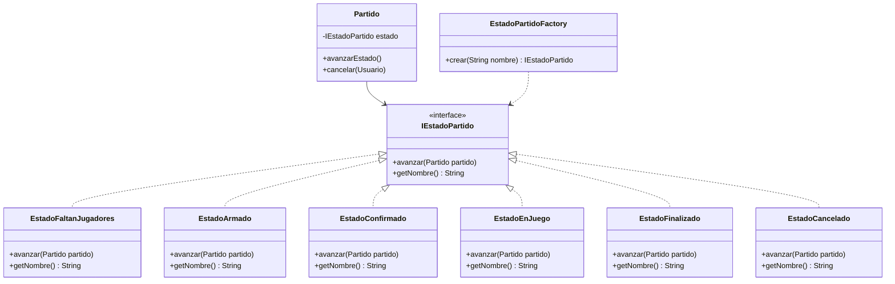
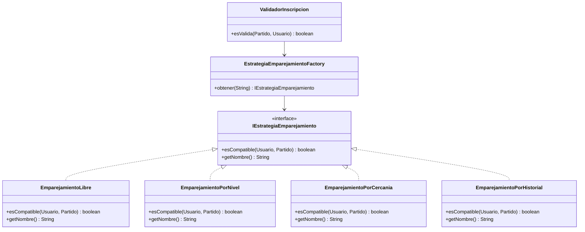
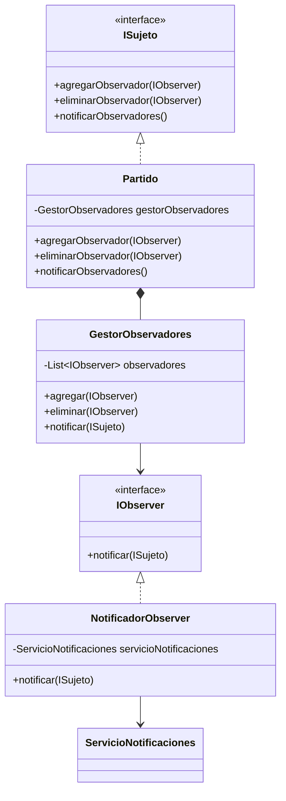
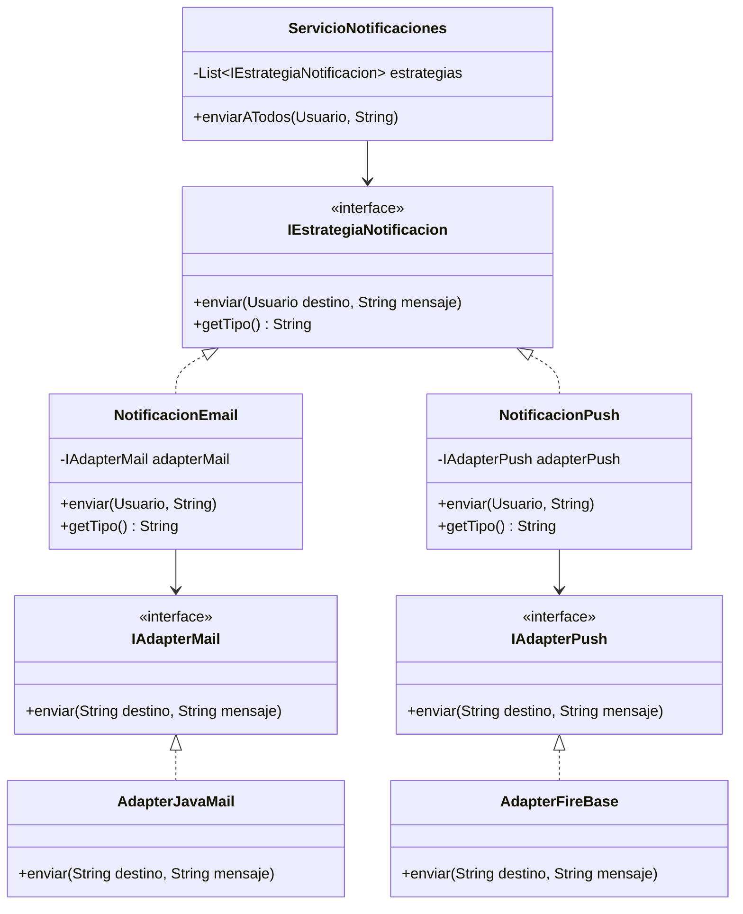
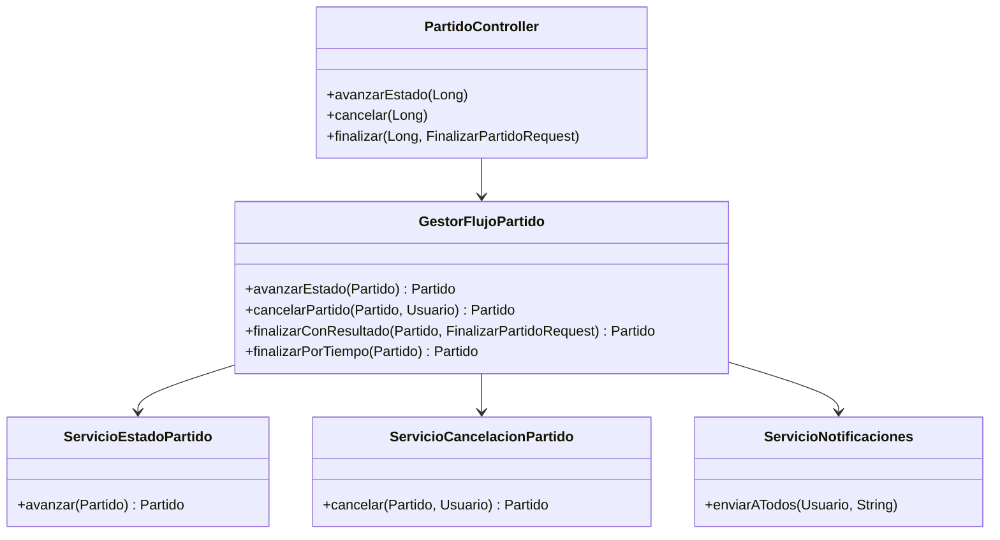
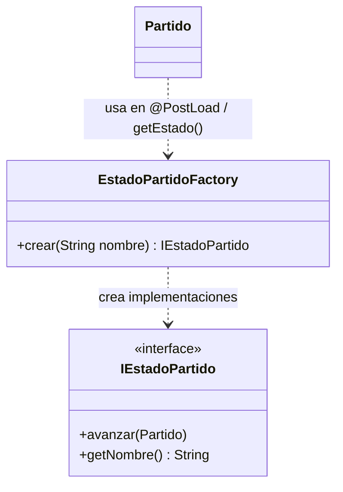

# Patrones de Diseño Implementados - Uno Mas

Este documento describe los patrones de diseño utilizados en el sistema "Uno Mas", un sistema de gestión de encuentros deportivos. Se implementaron cinco patrones del catálogo: **State**, **Strategy**, **Observer**, **Adapter** y **Facade**, además del patrón **Factory** (Simple Factory) como apoyo en la creación de estados y estrategias.

---

## 1. Patrón State (Estado)

### Propósito

Permite que un objeto altere su comportamiento cuando cambia su estado interno, de forma que parezca que el objeto cambia de clase. En nuestro sistema, un `Partido` atraviesa distintos estados durante su ciclo de vida, y el comportamiento del método `avanzar()` cambia según el estado actual.

### Diagrama de Clases



### Transiciones de Estado

```
FALTAN_JUGADORES → ARMADO → CONFIRMADO → EN_JUEGO → FINALIZADO
         ↓             ↓          ↓
       CANCELADO    CANCELADO   CANCELADO
```

### Cómo funciona

1. **Interfaz `IEstadoPartido`**: Define el contrato con dos métodos: `avanzar(Partido)` que ejecuta la transición, y `getNombre()` que retorna el nombre del estado.

2. **Cada estado concreto** implementa su propia lógica de transición:
   - `EstadoFaltanJugadores.avanzar()`: solo transiciona a `EstadoArmado` si el cupo está completo.
   - `EstadoArmado.avanzar()`: transiciona a `EstadoConfirmado`.
   - `EstadoConfirmado.avanzar()`: transiciona a `EstadoEnJuego`.
   - `EstadoEnJuego.avanzar()`: transiciona a `EstadoFinalizado`.
   - `EstadoFinalizado` y `EstadoCancelado`: son estados terminales, `avanzar()` no hace nada.

3. **Persistencia**: Como los estados son objetos transitorios (`@Transient`), se almacena el nombre del estado como `String` en la base de datos. La reconstrucción del objeto de estado correcto al cargar la entidad (`@PostLoad`) o al invocar `getEstado()` se delega en el **patrón Factory**: `EstadoPartidoFactory.crear(nombre)` devuelve la instancia concreta según el nombre (véase sección 6).

4. **`Partido.avanzarEstado()`** delega al estado actual:
   ```java
   public void avanzarEstado() {
       getEstado().avanzar(this);
       notificarObservadores(); // Observer pattern se activa aquí
   }
   ```

### Archivos involucrados

- `backend/src/main/java/com/unomas/model/estado/IEstadoPartido.java`
- `backend/src/main/java/com/unomas/model/estado/EstadoFaltanJugadores.java`
- `backend/src/main/java/com/unomas/model/estado/EstadoArmado.java`
- `backend/src/main/java/com/unomas/model/estado/EstadoConfirmado.java`
- `backend/src/main/java/com/unomas/model/estado/EstadoEnJuego.java`
- `backend/src/main/java/com/unomas/model/estado/EstadoFinalizado.java`
- `backend/src/main/java/com/unomas/model/estado/EstadoCancelado.java`
- `backend/src/main/java/com/unomas/model/estado/EstadoPartidoFactory.java`

---

## 2. Patrón Strategy (Estrategia)

### Propósito

Define una familia de algoritmos, encapsula cada uno de ellos, y los hace intercambiables. En nuestro sistema se usa para las **estrategias de emparejamiento** de jugadores: un partido puede configurarse con diferentes algoritmos de emparejamiento sin cambiar el código que los utiliza.

### Diagrama de Clases



### Cómo funciona

1. **Interfaz `IEstrategiaEmparejamiento`**: Define `esCompatible(Usuario, Partido)` que determina si un jugador puede unirse a un partido.

2. **Estrategias concretas**:
   - `EmparejamientoLibre`: siempre retorna `true`, cualquier jugador puede unirse.
   - `EmparejamientoPorNivel`: valida que el nivel del jugador (PRINCIPIANTE=1, INTERMEDIO=2, AVANZADO=3) esté dentro del rango configurado en el partido (nivelMinimo/nivelMaximo).
   - `EmparejamientoPorCercania`: calcula la distancia geográfica (fórmula de Haversine) entre jugador y organizador, aceptando jugadores dentro de 20 km.
   - `EmparejamientoPorHistorial`: requiere un mínimo de 3 victorias previas para unirse.

3. **`EstrategiaEmparejamientoFactory`** (patrón Factory): Resuelve la estrategia correcta a partir del nombre almacenado en el partido. Usa inyección de dependencias de Spring para recolectar todas las implementaciones de `IEstrategiaEmparejamiento` y las expone por nombre; si el nombre no existe, devuelve la estrategia "LIBRE" (véase sección 6).

4. **`ValidadorInscripcion`**: Valida múltiples condiciones antes de usar la estrategia:
   ```java
   public boolean esValida(Partido partido, Usuario jugador) {
       if (!"FALTAN_JUGADORES".equals(partido.getEstadoNombre())) return false;
       if (partido.cupoCompleto()) return false;
       if (partido.getJugadores().stream().anyMatch(j -> j.getId().equals(jugador.getId()))) return false;
       IEstrategiaEmparejamiento estrategia = estrategiaFactory.obtener(partido.getEstrategiaEmparejamiento());
       return estrategia.esCompatible(jugador, partido);
   }
   ```

### Archivos involucrados

- `backend/src/main/java/com/unomas/model/emparejamiento/IEstrategiaEmparejamiento.java`
- `backend/src/main/java/com/unomas/model/emparejamiento/EmparejamientoLibre.java`
- `backend/src/main/java/com/unomas/model/emparejamiento/EmparejamientoPorNivel.java`
- `backend/src/main/java/com/unomas/model/emparejamiento/EmparejamientoPorCercania.java`
- `backend/src/main/java/com/unomas/model/emparejamiento/EmparejamientoPorHistorial.java`
- `backend/src/main/java/com/unomas/model/emparejamiento/EstrategiaEmparejamientoFactory.java`
- `backend/src/main/java/com/unomas/service/ValidadorInscripcion.java`

---

## 3. Patrón Observer (Observador)

### Propósito

Define una relación de uno-a-muchos entre objetos, de manera que cuando un objeto cambia de estado, todos sus dependientes son notificados y actualizados automáticamente. En nuestro sistema, cuando un `Partido` cambia de estado, se notifica a todos los jugadores inscriptos.

### Diagrama de Clases



### Cómo funciona

1. **`ISujeto`**: Interfaz que implementa `Partido`, con métodos para agregar, eliminar y notificar observadores.

2. **`GestorObservadores`**: Clase auxiliar que mantiene la lista de `IObserver` y ejecuta la notificación. `Partido` usa composición (no herencia) con esta clase.

3. **`IObserver`**: Interfaz con un único método `notificar(ISujeto)`.

4. **`NotificadorObserver`**: Implementación concreta que, al recibir una notificación, extrae la información del partido (deporte, estado, jugadores) y delega al `ServicioNotificaciones` para enviar mensajes a cada jugador.

5. **Flujo**: Cuando se avanza el estado de un partido o se inscribe un jugador, los servicios registran un `NotificadorObserver` y luego el partido invoca `notificarObservadores()`:
   ```java
   partido.agregarObservador(new NotificadorObserver(servicioNotificaciones));
   partido.avanzarEstado(); // internamente llama notificarObservadores()
   ```

### Eventos que disparan notificaciones

Según los requerimientos del PDF:
- Se crea un partido nuevo para su deporte favorito
- Se unen suficientes jugadores y el partido pasa a "Partido armado"
- Se confirma el partido
- El partido cambia a "En juego", "Finalizado" o "Cancelado"

### Archivos involucrados

- `backend/src/main/java/com/unomas/model/observador/ISujeto.java`
- `backend/src/main/java/com/unomas/model/observador/IObserver.java`
- `backend/src/main/java/com/unomas/model/observador/GestorObservadores.java`
- `backend/src/main/java/com/unomas/model/observador/NotificadorObserver.java`
- `backend/src/main/java/com/unomas/model/Partido.java` (implementa ISujeto)

---

## 4. Patrón Adapter (Adaptador)

### Propósito

Convierte la interfaz de una clase en otra interfaz que los clientes esperan. En nuestro sistema, se usan adaptadores para abstraer los servicios externos de notificación (JavaMail para emails y Firebase para push notifications) detrás de interfaces uniformes.

### Diagrama de Clases



### Cómo funciona

1. **Interfaces Adapter**:
   - `IAdapterMail`: interfaz para el envío de emails con método `enviar(destino, mensaje)`.
   - `IAdapterPush`: interfaz para el envío de push notifications con método `enviar(destino, mensaje)`.

2. **Adaptadores concretos**:
   - `AdapterJavaMail`: adapta la librería JavaMail (simulado con logging). Si en el futuro se integra JavaMail real, solo se modifica esta clase.
   - `AdapterFireBase`: adapta Firebase Cloud Messaging (simulado con logging). Cuando se integre Firebase real, solo se modifica esta clase.

3. **Estrategias de Notificación** (Strategy dentro de Adapter):
   - `NotificacionEmail`: usa `IAdapterMail` para enviar emails, extrayendo el mail del usuario destino.
   - `NotificacionPush`: usa `IAdapterPush` para enviar push, usando el nombre del usuario como destino.

4. **`ServicioNotificaciones`**: Orquesta el envío por todos los canales. Recibe por inyección todas las `IEstrategiaNotificacion` disponibles y las ejecuta, además de persistir cada notificación en la base de datos:
   ```java
   public void enviarATodos(Usuario destino, String mensaje) {
       for (IEstrategiaNotificacion estrategia : estrategias) {
           estrategia.enviar(destino, mensaje);
           notificacionRepository.save(new Notificacion(destino, mensaje, estrategia.getTipo()));
       }
   }
   ```

5. **Beneficio clave**: Si se cambia de JavaMail a otra librería de email, o de Firebase a otro servicio push, solo se reemplaza el adaptador concreto sin modificar `NotificacionEmail`, `NotificacionPush`, ni `ServicioNotificaciones`.

### Archivos involucrados

- `backend/src/main/java/com/unomas/model/notificacion/IAdapterMail.java`
- `backend/src/main/java/com/unomas/model/notificacion/IAdapterPush.java`
- `backend/src/main/java/com/unomas/model/notificacion/AdapterJavaMail.java`
- `backend/src/main/java/com/unomas/model/notificacion/AdapterFireBase.java`
- `backend/src/main/java/com/unomas/model/notificacion/IEstrategiaNotificacion.java`
- `backend/src/main/java/com/unomas/model/notificacion/NotificacionEmail.java`
- `backend/src/main/java/com/unomas/model/notificacion/NotificacionPush.java`
- `backend/src/main/java/com/unomas/model/notificacion/ServicioNotificaciones.java`

---

## Patrón Arquitectónico: MVC

Además de los cinco patrones de diseño, el sistema sigue el patrón arquitectónico **Model-View-Controller**:

- **Model**: Entidades JPA (`Usuario`, `Partido`, `Deporte`, `Notificacion`) y la lógica de dominio (estados, estrategias, observadores, adaptadores).
- **View**: Frontend React que presenta la interfaz al usuario.
- **Controller**: Controladores REST de Spring (`AuthController`, `PartidoController`, `UsuarioController`, `DeporteController`, `NotificacionController`) que reciben peticiones HTTP y coordinan con los servicios.

La capa de servicios (`ServicioUsuarios`, `ServicioPartidos`, `ServicioInscripcionPartido`, etc.) actúa como intermediaria entre los controladores y el modelo, manteniendo la separación de responsabilidades.

---

## 5. Patrón Facade (Fachada)

### Propósito

Proporciona una interfaz unificada para un conjunto de interfaces en un subsistema. Define una interfaz de alto nivel que hace que el subsistema sea más fácil de usar.

### Implementación: `GestorFlujoPartido`

El `GestorFlujoPartido` actúa como fachada para coordinar las operaciones complejas del ciclo de vida de un partido, simplificando la interacción desde los controladores.



### Cómo funciona

1. **Coordinación de servicios**: `GestorFlujoPartido` orquesta múltiples servicios especializados (`ServicioEstadoPartido`, `ServicioCancelacionPartido`, `ServicioNotificaciones`) en operaciones cohesivas.

2. **Registro de observadores**: Antes de cada operación, registra automáticamente el `NotificadorObserver` para garantizar que los jugadores sean notificados:
   ```java
   public Partido avanzarEstado(Partido partido) {
       partido.agregarObservador(new NotificadorObserver(servicioNotificaciones));
       return servicioEstadoPartido.avanzar(partido);
   }
   ```

3. **Operaciones complejas**: Encapsula lógica como `finalizarConResultado()` (actualiza resultados, asigna ganador, incrementa victorias y notifica) y `finalizarPorTiempo()` (cierra automáticamente un partido en juego cuando se cumple la duración programada, generando resultado y ganador aleatorios si no se definieron). Además utiliza `PartidoRepository` y `ServicioUsuarios` para persistencia y obtención del ganador.

### Archivos involucrados

- `backend/src/main/java/com/unomas/service/GestorFlujoPartido.java`
- `backend/src/main/java/com/unomas/service/ServicioEstadoPartido.java`
- `backend/src/main/java/com/unomas/service/ServicioCancelacionPartido.java`

---

## 6. Patrón Factory (Simple Factory)

### Propósito

Centraliza la creación de objetos sin exponer la lógica de instanciación al cliente. El cliente trabaja con una interfaz o tipo base y recibe la implementación concreta adecuada según un identificador (por ejemplo, un nombre). Así se evita usar `new` de clases concretas disperso en el código y se facilita añadir nuevos tipos en un solo lugar.

### Implementaciones en el sistema

Hay tres usos claros del Factory en el proyecto:

1. **`EstadoPartidoFactory`** (estados del partido):  
   Clase con método estático `crear(String nombre)` que, dado el nombre del estado persistido en base de datos (`"FALTAN_JUGADORES"`, `"ARMADO"`, etc.), devuelve la instancia correcta de `IEstadoPartido`. Se usa en `Partido` en `@PostLoad` y en `getEstado()` para reconstruir el objeto de estado a partir de `estadoNombre`. Si el nombre no es reconocido, lanza `IllegalArgumentException`.

2. **`EstrategiaEmparejamientoFactory`** (estrategias de emparejamiento):  
   Componente de Spring que recibe por inyección todas las implementaciones de `IEstrategiaEmparejamiento`. Las indexa por `getNombre()` y expone `obtener(String nombre)` para devolver la estrategia correspondiente. Si el nombre no existe, devuelve la estrategia `"LIBRE"`. Lo usa `ValidadorInscripcion` para obtener la estrategia configurada en el partido.

3. **`NivelBase.crearPorNombre(String nombre)`** (niveles de jugador):  
   Método estático que devuelve la implementación de `INivel` según el nombre (`"PRINCIPIANTE"`, `"INTERMEDIO"`, `"AVANZADO"`). Por defecto devuelve `NivelPrincipiante`. La jerarquía de nivel también sigue un patrón tipo State (transición entre niveles con `avanzar(Usuario)`); ver sección 7.

### Diagrama (Factory de estados)



### Archivos involucrados

- `backend/src/main/java/com/unomas/model/estado/EstadoPartidoFactory.java`
- `backend/src/main/java/com/unomas/model/emparejamiento/EstrategiaEmparejamientoFactory.java`
- `backend/src/main/java/com/unomas/model/nivel/NivelBase.java` (método `crearPorNombre`)

---

## 7. State y Factory en el modelo Nivel

El paquete `model/nivel` modela el **nivel del jugador** (PRINCIPIANTE, INTERMEDIO, AVANZADO) con una jerarquía que combina **State** y **Factory**:

- **Interfaz `INivel`**: Define `getNombre()`, `getValor()` y `avanzar(Usuario)`. Cada nivel concreto puede transicionar al siguiente cuando el usuario cumple condiciones (por ejemplo, victorias).
- **Clases concretas**: `NivelPrincipiante`, `NivelIntermedio`, `NivelAvanzado` extienden `NivelBase` e implementan `avanzar()` para pasar al siguiente nivel o mantenerse (avanzado es terminal).
- **Factory**: `NivelBase.crearPorNombre(String)` construye la instancia de `INivel` según el nombre; se usa cuando se necesita un objeto nivel a partir del valor persistido.
- **Uso en emparejamiento**: `EmparejamientoPorNivel` usa `NivelBase.getValorPorNombre(String)` para comparar nivel del jugador con `nivelMinimo` y `nivelMaximo` del partido (sin instanciar estados).

### Archivos involucrados

- `backend/src/main/java/com/unomas/model/nivel/INivel.java`
- `backend/src/main/java/com/unomas/model/nivel/NivelBase.java`
- `backend/src/main/java/com/unomas/model/nivel/NivelPrincipiante.java`
- `backend/src/main/java/com/unomas/model/nivel/NivelIntermedio.java`
- `backend/src/main/java/com/unomas/model/nivel/NivelAvanzado.java`

---

## Resumen

| Patrón   | Ubicación                        | Problema que resuelve                                                                 |
|----------|----------------------------------|---------------------------------------------------------------------------------------|
| State    | `model/estado/`                  | Gestionar las transiciones de estado del partido sin condicionales complejos           |
| Strategy | `model/emparejamiento/`          | Permitir diferentes algoritmos de emparejamiento intercambiables                       |
| Observer | `model/observador/`              | Notificar automáticamente a los jugadores cuando cambia el estado de un partido        |
| Adapter  | `model/notificacion/`            | Desacoplar el sistema de los servicios externos de notificación (email y push)         |
| Facade   | `service/GestorFlujoPartido`     | Simplificar la coordinación de servicios para operaciones del ciclo de vida del partido |
| Factory  | `model/estado/`, `model/emparejamiento/`, `model/nivel/` | Centralizar la creación de estados, estrategias y niveles a partir de un nombre        |
| State + Factory | `model/nivel/`           | Modelar el nivel del jugador (PRINCIPIANTE → INTERMEDIO → AVANZADO) y su creación por nombre |
